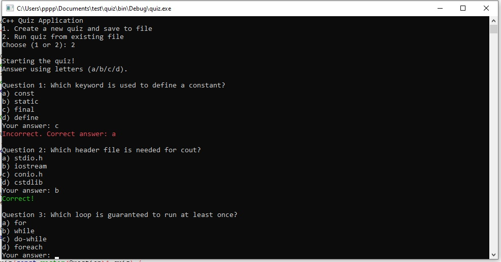

# 🎓 C++ Quiz App

A simple console-based multiple-choice quiz application written in C++. Users can either create their own quiz questions or take a quiz from a saved file.

## 🚀 Features

- Create custom quiz questions and save them to a file
- Load and run quizzes from a file
- Multiple-choice format with 4 options per question
- Score tracking and feedback
- Colored output for correct (green) and incorrect (red) answers (Windows only)

## 🖥 Requirements

- Windows OS (for colored output using `Windows.h`)
- C++17 or later
- Any C++ compiler (e.g., g++, MSVC)

## 📂 File Structure

- `main.cpp` — Main source file containing all logic
- `questions.txt` — Stores quiz questions in plain text format

## 📄 Question File Format

Each question in `questions.txt` should follow this structure:

Each question block is separated by a blank line.

## 🧑‍💻 How to Use

### 1. Compile the App

```bash
use code blouck

🎨 Console Colors
• 	✅ Correct answers are shown in green
• 	❌ Incorrect answers are shown in red
## 📸 Screenshot




